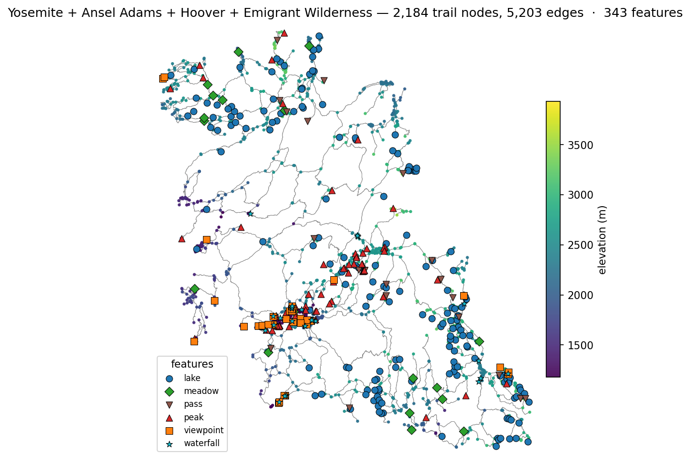
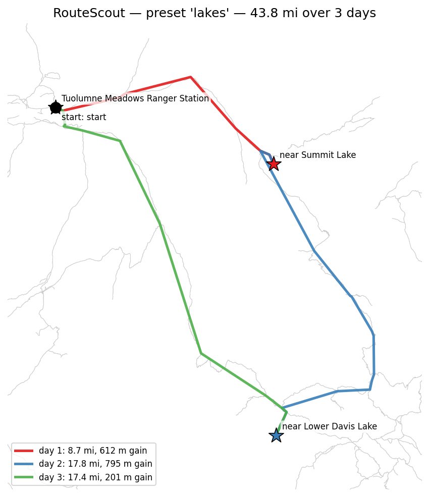
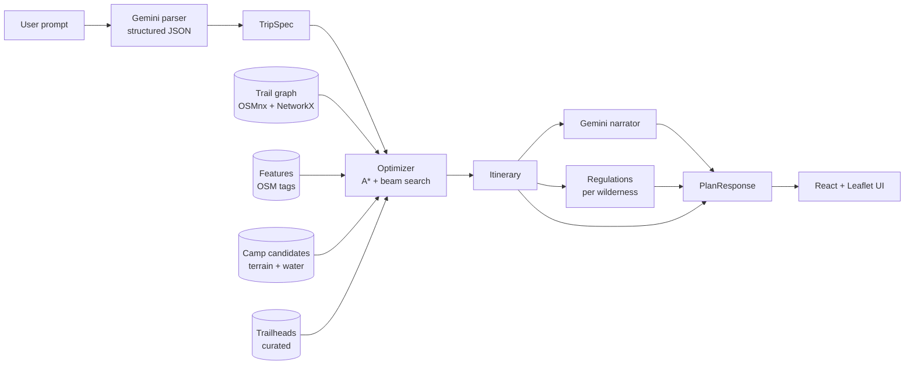

# RouteScout

A natural-language hiking trip planner for the Sierra Nevada — Yosemite National Park plus Ansel Adams, Hoover, and Emigrant Wildernesses. Describe the trip you want — *"3-day loop from Tuolumne Meadows camping at lakes, 9 miles a day"* — and get back a day-by-day itinerary with a routed map, an elevation profile, the relevant wilderness regulations, and a written trip plan.



*The full coverage area as a graph: 2,184 trail nodes, 5,203 edges, 343 named features (175 lakes, 72 peaks, 24 waterfalls, 33 viewpoints, 21 passes, 18 meadows). Colored by node elevation.*

## What it does

A hiker types something in plain English. Behind the scenes:

1. **Parse** — Gemini 2.5 Flash maps the prompt to a structured trip spec (trailhead, days, mileage target, preferred features, named must-visits) using JSON schema-constrained output. Vague prompts (`easy`, `weekend`, `day hike`) get sensible defaults.
2. **Plan** — A\* on an OSM-derived trail graph (one segment per day), beam search across overnight camp candidates (multi-day). Camps are restricted to terrain-flat-and-near-water nodes. Backcountry rules (no camping in Yosemite Valley, Tuolumne Meadows, Wawona, or Crane Flat developed areas) enforced as exclusion zones.
3. **Generate** — Gemini writes the trip narrative grounded only on the resolved itinerary (no hallucination of features or distances).
4. **Render** — Frontend draws the route on OpenTopoMap tiles with elevation profile, day-by-day breakdown, and wilderness-specific regulation notes.

## Why this is technically interesting

Most "AI-powered X" portfolio projects are prompt-engineering wrappers. The work here is in the planner that runs *underneath* the LLM.

- **A\* + beam search hybrid.** A\* with great-circle distance heuristic for single-day shortest paths. Beam search across overnight camp sequences for multi-day; states track visited edges so the scoring penalizes reused trails (no figure-8 routes pretending to be loops). Penultimate-day lookahead filter keeps the search from committing to camps with no feasible return path.
- **Adaptive beam width.** When feature-preference scoring (e.g., "prefer lakes") pushes the top-K beam toward dead-end branches, the planner widens to 24 → 36 candidates before declaring infeasibility. Same effect as IDA\* — try harder before giving up.
- **Terrain-derived camps.** Camp candidates aren't a hand-picked list. Each graph node is checked for max local edge grade < 10% (flat enough to tent on) and within 700 m of a curated water feature (cooking water in walking distance). Same heuristic a backpacker uses.
- **Real OSM trail geometry.** Routed lines follow the actual curves of OSM `geometry` LineStrings on each edge, not straight lines between graph nodes. A single day path goes from ~7 graph nodes to ~1,100 polyline points.
- **Wilderness-aware regulations.** Each managed by a different agency (NPS Yosemite, Inyo NF, Humboldt-Toiyabe NF, Stanislaus NF) with different permit processes; planner attaches the right info per trip. Half Dome cables permit detection, Donohue Pass cross-jurisdiction note, Tioga / Glacier Point / Sonora Pass seasonal closure detection by start trailhead.
- **Structured LLM output with Pydantic schemas.** The parser's response shape is enforced server-side by Gemini's `response_schema` config; tolerant lookup handles common LLM output quirks (parenthetical region appended, "X or Y" disjunctions, stripped suffix).

## Coverage

Bbox: **37.45°N to 38.35°N, -119.95°W to -118.95°W**.

| Wilderness         | Trailheads | Notable features in scope                                  |
|--------------------|-----------:|------------------------------------------------------------|
| Yosemite NP        |         24 | Half Dome, Cathedral Lakes, Glacier Point, Vernal/Nevada Falls |
| Ansel Adams        |          3 | Thousand Island Lake, Banner Peak, Donohue Pass            |
| Hoover             |          4 | Twin Lakes (Bridgeport), Matterhorn Peak, Twenty Lakes Basin |
| Emigrant           |          2 | Kennedy Lake, Relief Reservoir, Crabtree                   |

Trailheads with no nearby trail in the OSM hiking-only graph (Mariposa Grove, etc.) are dropped.

## Example planned trip



*3-day loop from Tuolumne Meadows Ranger Station: 43.8 mi, camps at Summit Lake (Yosemite high country) and Lower Davis Lake (Ansel Adams Wilderness, JMT corridor). Each day a different colored route; circular topology, no trail re-use.*

## Architecture



## Tech

| Layer    | Stack                                                                 |
|----------|-----------------------------------------------------------------------|
| Backend  | Python 3.12 · FastAPI · Pydantic · slowapi · OSMnx · NetworkX · scikit-learn |
| LLM      | Gemini 2.5 Flash-Lite (structured JSON output, Pydantic-validated)    |
| Data     | OpenStreetMap (Overpass API via OSMnx) · SRTM via Open-Elevation       |
| Frontend | React 19 · TypeScript · Vite · Tailwind v4 · Leaflet · recharts · lucide-react |
| Tiles    | OpenTopoMap (CC-BY-SA)                                                |
| Tests    | pytest                                                                |
| Deploy   | Render (backend, Docker) · Vercel (frontend)                          |
| CI       | GitHub Actions                                                         |

## Local setup

```bash
# Backend (Python 3.12)
cd backend
python3.12 -m venv venv
source venv/bin/activate
pip install -r requirements.txt
cp .env.example .env       # add GEMINI_API_KEY
uvicorn backend.api.main:app --reload --port 8000

# Frontend (Node ≥ 20.19)
cd frontend
npm install
npm run dev
# → http://localhost:5173
```

The Vite dev server proxies `/api/*` to `http://127.0.0.1:8000`, so the frontend works without CORS in dev. For production, set `VITE_API_BASE_URL` to your deployed backend.

The trail graph, features, trailheads, and camp candidates are precomputed and cached in `data/` (no first-request rebuild). To rebuild from scratch:

```bash
python -m backend.graph.build --rebuild
python -m backend.graph.features
python -m backend.graph.trailheads
python -m backend.graph.camps
```

## Tests

```bash
cd backend && pytest tests
```

26 tests covering optimizer (per-day target scaling, edge dedupe, day-hike branch, unknown start), pathfinder (haversine, A\*, length sum, ascent-only gain), parser tolerant lookup (case, parens, suffix add/remove, "X or Y" disjunction split), and trip spec invariants. Runs in about a second; no network or LLM calls.

CI runs the backend tests + a frontend typecheck/build/lint on every push and PR (`.github/workflows/ci.yml`).

## Deploy

- **Backend** — `render.yaml` declares a Docker web service on Render's free tier. Set `GEMINI_API_KEY` in the dashboard. The Dockerfile is multi-stage (heavy native deps for OSMnx/geopandas in the builder, slim runtime ships only the venv + app + pre-built data caches).
- **Frontend** — `frontend/vercel.json` rewrites `/api/*` to the Render backend URL. Vercel auto-detects Vite.

## Source

[github.com/dpappachan/RouteScout](https://github.com/dpappachan/RouteScout)
